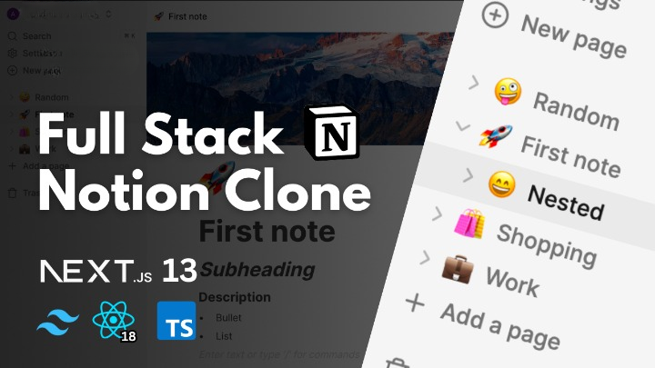

# Jotion-using-NextJS

Jotion is a freemium web application designed for productivity and note-taking. It leverages various cutting-edge technologies to provide an exceptional user experience. The application is built on NextJS, utilizing server-side rendering and TypeScript, and it harnesses the power of React to create reusable components. Jotion boasts an aesthetically pleasing layout, carefully crafted with Tailwind CSS. User authentication is seamlessly managed through Clerk, allowing users to log in using popular social accounts. The application relies on the strength of Shadcn components, and handling file uploads is made effortless with Edgestore. The backend infrastructure is robustly supported by Convex. Jotion combines the latest advancements in web development to deliver a top-tier user experience and enhanced functionality.

## Live Project Link

The project is hosted on Vercel and can be accessed using the following link - https://jotionnote.vercel.app/

## Features

- Next.js 13.4 with Server Side Rendering
- Real-time database 🔗
- Notion-style editor 📝
- Light and Dark mode 🌓
- Infinite children documents 🌲
- Trash can & soft delete 🗑️
- Authentication 🔐
- File upload
- File deletion
- File replacement
- Icons for each document (changes in real-time) 🌠
- Expandable sidebar ➡️🔀⬅️
- Full mobile responsiveness 📱
- Publish your note to the web 🌐
- Fully collapsable sidebar ↕️
- Landing page 🛬
- Cover image of each document 🖼️
- Recover deleted files 🔄📄

## Technologies Used

The following technologies were used in the development of this project:

- NextJS - React framework that enables several extra features, including server-side rendering and generating static websites
- ReactJS - A JavaScript library for building user interfaces
- Convex - For handling schemas, multiple data population and realtime & live functionality
- Clerk - To handle authentication and create organizations
- Shadcn UI - Focuses on accessibility and includes components such as buttons, menus, dialogs, tooltips, and more
- EdgeStore - It is a file-uploading service designed for Next.js developers
- Tailwind CSS - Open source CSS framework

## Conclusion

In summary, Jotion is a freemium web app for productivity and note-taking, offering a top-notch user experience. It's built with NextJS and TypeScript, leveraging React for reusable components, and features a stunning design with Tailwind CSS. User authentication is seamless through Clerk, and the app is optimized with Shadcn components and Edgestore for efficient file uploads. The robust backend is supported by Convex. Jotion combines cutting-edge web technologies to provide a feature-rich and visually appealing platform.
